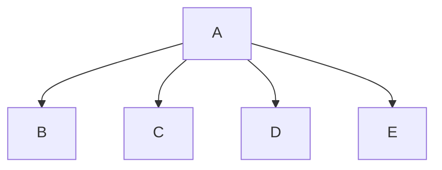

# Chapter 5 Team Project - Number Guessing Game
Hays, Paco

## Number Guessing Game Description
This is a menu driven number guessing game.  Two players will guess a number from 1 to the chosen value.
The game ends when someone correctly guesses the number.

### <program_name> Flowchart

#### Function Diagrams

| `function name1`    |               |  author     |
| ------------------ | ------------- | ------------ |
| `argument:type`    | takes input from the user for ____  |              |
| `time:integer`     | calculates ______  | outputs ____             |
| `name:string`      | takes input for name ___ | returns total |
***
| `function name2`    |               |     author   |
| ------------------ | ------------- | ------------ |
| `argument:type`    | takes input from the user for ____  |              |
| `time:integer`     | calculates ______  | outputs ____             |
| `name:string`      | takes input for name ___ | returns total |
***
